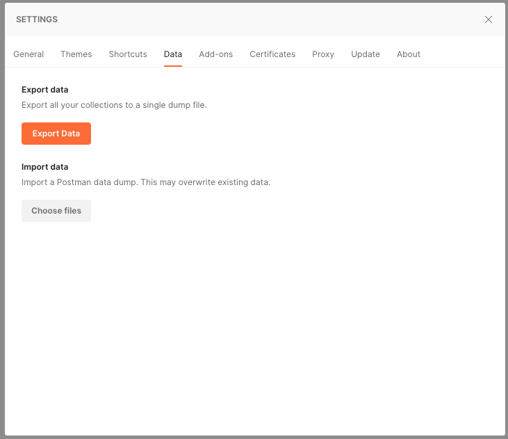
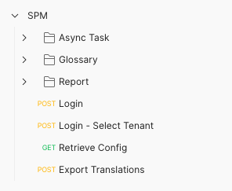
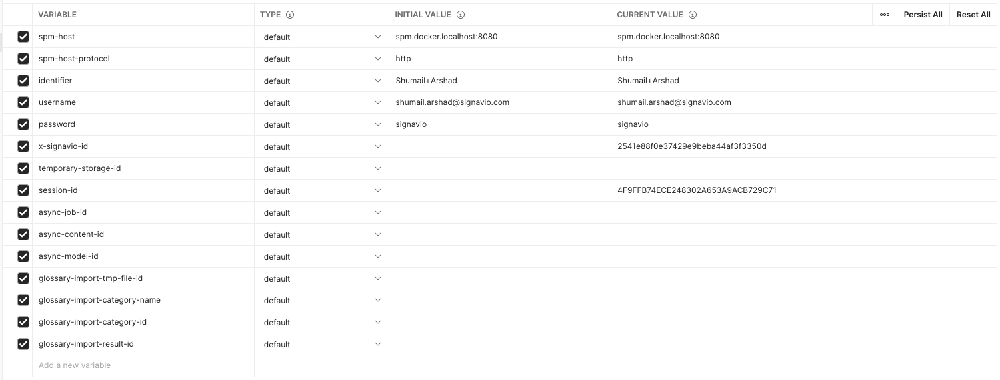

# spm-postman-collections

### How to import the collection into your Postman

Open settings and go to Data tab. Click on Choose files under Import data and select all the json files in this repository

Once you have imported you should see all the SPM collection in your workspace.

And you should have Local & Staging Environment. In each environment, update `identifier`, `username` and `password` properties.

### How to use Postman Collection

- First, send `Login` request which will update the selected environment with cookies data. If you have multiple tenants for the user, you need to send `Login - Select Tenant` after setting target-tenant-id in the environment.
- Use any other request, as it will use cookies saved from the Login request.

